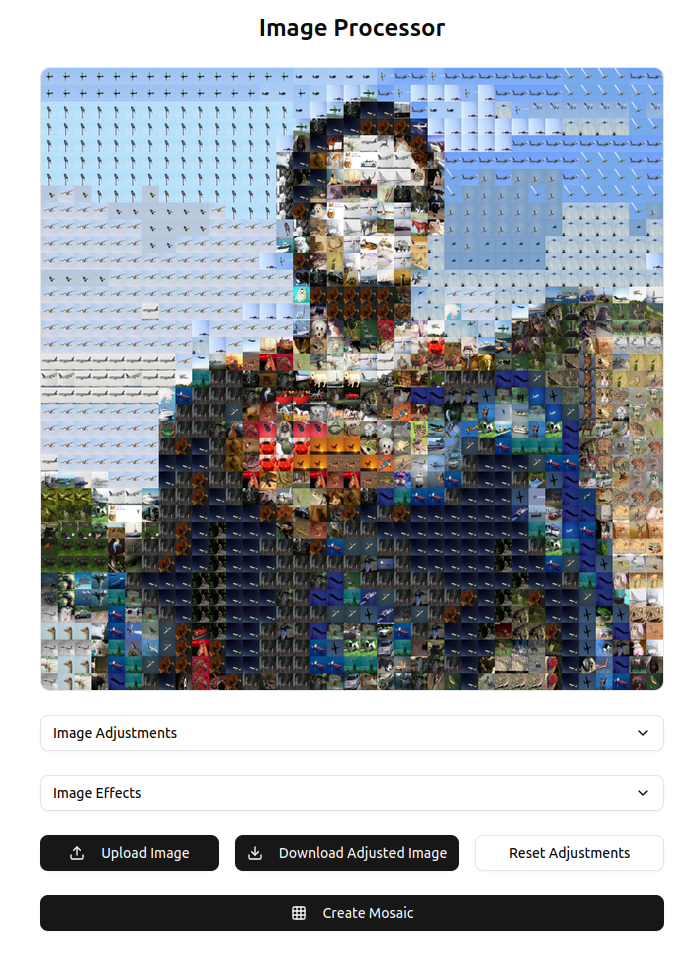

# Mosaic App

A single page webapp for image adjustment and the creation of mosaic images using the [CIFAR-10 dataset](https://www.cs.toronto.edu/~kriz/cifar.html).



## Run Locally

To run locally simply run the docker compose file with:

```bash
  docker compose up --build
```

and connect to `localhost:3000` in your local browser :)

> **_NOTE:_** This may take some time to build as the CIFAR-10 dataset needs to be downloaded and the data fitted to the KNN algorithm.

To increase the number of images used in the mosaic creation algorithm, increate the NUM_POINTS env var in the `docker-compose.yaml` file.